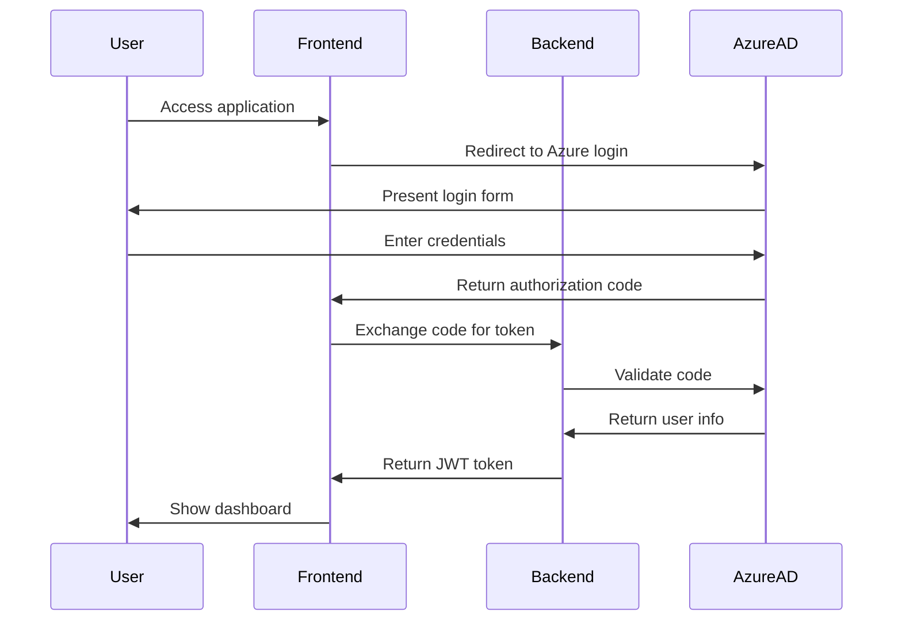
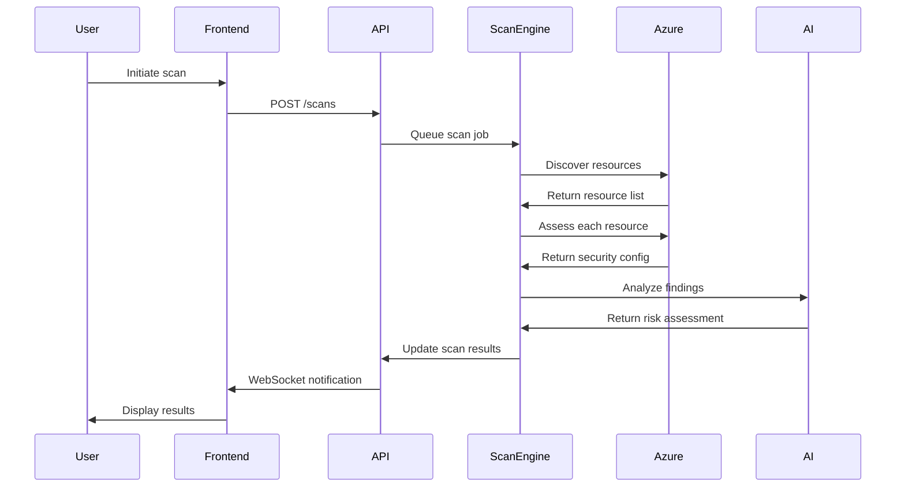
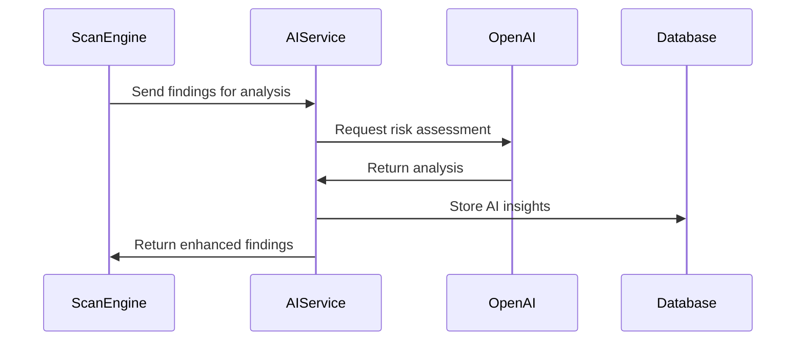

# SecurityA System Workflow Guide

## Overview

This document provides a comprehensive guide to understanding the SecurityA cloud security assessment platform's design, architecture, components, and workflow. It serves as a reference for developers, security professionals, and stakeholders to understand how the system operates.

## System Architecture

### 1. Layered Architecture Pattern

SecurityA follows a **5-layer architecture** pattern:

#### Layer 1: User Layer
- **Security Administrators**: Manage security policies and oversee compliance
- **DevOps Engineers**: Monitor infrastructure security and implement fixes
- **Compliance Officers**: Generate reports and ensure regulatory compliance

#### Layer 2: Presentation Layer (React Frontend)
- **Login Page**: Azure OAuth2 authentication interface
- **Dashboard**: Risk overview and security metrics visualization
- **Scans Page**: Security scan management and configuration
- **Scan Details**: Detailed findings view with remediation steps
- **Reports Page**: PDF/Excel report generation and download
- **Chatbot**: AI-powered security assistant
- **Settings**: User preferences and system configuration

#### Layer 3: API Gateway Layer (FastAPI)
- **Authentication Service**: JWT token management and validation
- **Scan Management API**: CRUD operations for security scans
- **AI Analysis API**: Integration with OpenAI for intelligent analysis
- **Report Generation API**: Document creation and export services

#### Layer 4: Business Logic Layer (Microservices)
- **Auth Service**: User authentication and authorization
- **Scan Engine**: Azure resource discovery and security assessment
- **AI Analysis**: Risk scoring and recommendation generation
- **Report Generator**: PDF/Excel document creation
- **Chatbot Service**: Context-aware AI conversations
- **Notification Service**: Email alerts and system notifications
- **Task Queue**: Asynchronous job processing with Celery

#### Layer 5: Data Access Layer
- **PostgreSQL**: Primary database for structured data
- **Redis Cache**: Session storage and caching layer
- **File Storage**: Report files and scan artifacts
- **Session Store**: User session management

### 2. External Services Integration

- **Azure Active Directory**: OAuth2 authentication provider
- **Azure APIs**: Resource management and security assessment
- **OpenAI API**: GPT-3.5 for AI-powered analysis
- **Email Service**: SMTP for notifications
- **Monitoring**: Application performance and health monitoring

## Core Components Deep Dive

### Frontend Components (React/TypeScript)

```
src/
├── components/
│   └── Layout/           # Common UI components
├── contexts/
│   ├── AuthContext.tsx   # Authentication state management
│   └── SnackbarContext.tsx # Notification system
├── pages/
│   ├── LoginPage.tsx     # Azure OAuth2 login
│   ├── DashboardPage.tsx # Security overview dashboard
│   ├── ScansPage.tsx     # Scan management interface
│   ├── ScanDetailPage.tsx # Individual scan results
│   ├── ReportsPage.tsx   # Report generation and download
│   ├── ChatbotPage.tsx   # AI assistant interface
│   └── SettingsPage.tsx  # User configuration
└── utils/                # Helper functions and utilities
```

### Backend Services (FastAPI/Python)

#### Database Schema

**Users Table**
```sql
CREATE TABLE users (
    id UUID PRIMARY KEY,
    email VARCHAR(255) UNIQUE NOT NULL,
    azure_id VARCHAR(255) UNIQUE,
    first_name VARCHAR(100),
    last_name VARCHAR(100),
    role VARCHAR(50) DEFAULT 'user',
    is_active BOOLEAN DEFAULT true,
    created_at TIMESTAMP DEFAULT CURRENT_TIMESTAMP
);
```

**Scans Table**
```sql
CREATE TABLE scans (
    id UUID PRIMARY KEY,
    user_id UUID REFERENCES users(id),
    organization_id UUID REFERENCES organizations(id),
    cloud_provider VARCHAR(50) NOT NULL,
    scan_type VARCHAR(100) NOT NULL,
    status VARCHAR(50) DEFAULT 'pending',
    config JSONB,
    results JSONB,
    risk_score INTEGER,
    started_at TIMESTAMP,
    completed_at TIMESTAMP
);
```

**Security Findings Table**
```sql
CREATE TABLE security_findings (
    id UUID PRIMARY KEY,
    scan_id UUID REFERENCES scans(id),
    finding_type VARCHAR(100) NOT NULL,
    severity VARCHAR(20) NOT NULL,
    title VARCHAR(255) NOT NULL,
    description TEXT,
    resource_id VARCHAR(255),
    resource_type VARCHAR(100),
    remediation_steps JSONB,
    ai_analysis JSONB
);
```

## User Workflow

### 1. Authentication Flow



### 2. Security Scan Workflow



### 3. AI Analysis Workflow



## API Endpoints

### Authentication Endpoints

- `POST /auth/login` - Exchange Azure code for JWT token
- `POST /auth/refresh` - Refresh expired access token
- `POST /auth/logout` - Invalidate current session

### Scan Management Endpoints

- `GET /scans` - List all scans with filtering
- `POST /scans` - Create new security scan
- `GET /scans/{scan_id}` - Get detailed scan information
- `GET /scans/{scan_id}/progress` - Get real-time scan progress
- `DELETE /scans/{scan_id}` - Cancel or delete scan

### Security Findings Endpoints

- `GET /scans/{scan_id}/findings` - Get all findings for a scan
- `GET /findings/{finding_id}` - Get detailed finding information
- `PUT /findings/{finding_id}/status` - Update finding status

### AI Assistant Endpoints

- `POST /ai/chat` - Send message to AI chatbot
- `GET /ai/recommendations` - Get AI-generated recommendations
- `POST /ai/analyze` - Request AI analysis of specific resources

### Report Generation Endpoints

- `POST /reports/generate` - Generate PDF/Excel report
- `GET /reports/{report_id}` - Download generated report
- `GET /reports` - List all generated reports

## Technology Stack Details

### Frontend Technologies

- **React 18**: Modern UI framework with hooks and context
- **TypeScript**: Type-safe JavaScript development
- **Material-UI**: Google's Material Design components
- **React Router**: Client-side routing
- **Axios**: HTTP client for API communication
- **React Query**: Server state management

### Backend Technologies

- **FastAPI**: High-performance Python web framework
- **SQLAlchemy**: Python SQL toolkit and ORM
- **Alembic**: Database migration tool
- **Pydantic**: Data validation using Python type annotations
- **Celery**: Distributed task queue
- **Redis**: In-memory data structure store

### AI and ML Technologies

- **OpenAI GPT-3.5**: Large language model for analysis
- **LangChain**: Framework for developing LLM applications
- **Prompt Engineering**: Optimized prompts for security analysis

### Azure Integration

- **Azure SDK**: Python libraries for Azure services
- **Azure Active Directory**: OAuth2 authentication
- **Azure Resource Manager**: Resource discovery and management
- **Azure Security Center**: Security recommendations integration

### Database and Storage

- **PostgreSQL**: Primary relational database
- **Redis**: Caching and session storage
- **File System**: Local storage for reports and artifacts

## Security Considerations

### Authentication and Authorization

- **OAuth2 with Azure AD**: Industry-standard authentication
- **JWT Tokens**: Stateless authentication with expiration
- **Role-Based Access Control**: Different permissions for user roles
- **API Key Management**: Secure storage of external service keys

### Data Protection

- **Encryption at Rest**: Database encryption for sensitive data
- **Encryption in Transit**: HTTPS/TLS for all communications
- **Data Anonymization**: PII protection in logs and reports
- **Audit Logging**: Comprehensive activity tracking

### API Security

- **Rate Limiting**: Protection against abuse
- **Input Validation**: Pydantic models for request validation
- **CORS Configuration**: Controlled cross-origin requests
- **Security Headers**: HSTS, CSP, and other protective headers

## Performance and Scalability

### Caching Strategy

- **Redis Caching**: Frequently accessed data caching
- **Database Query Optimization**: Indexed queries and connection pooling
- **CDN Integration**: Static asset delivery optimization

### Asynchronous Processing

- **Celery Task Queue**: Background job processing
- **WebSocket Notifications**: Real-time updates
- **Async/Await**: Non-blocking I/O operations

### Monitoring and Observability

- **Structured Logging**: JSON-formatted logs with Structlog
- **Metrics Collection**: Prometheus integration
- **Health Checks**: Application and dependency monitoring
- **Error Tracking**: Comprehensive error reporting

## Deployment Architecture

### Development Environment

- **Local Development**: Docker Compose for service orchestration
- **Hot Reloading**: Fast development iteration
- **Debug Configuration**: Comprehensive debugging setup

### Production Environment

- **Container Orchestration**: Kubernetes or Docker Swarm
- **Load Balancing**: Multiple backend instances
- **Database Clustering**: High availability PostgreSQL
- **Redis Clustering**: Distributed caching

## Future Enhancements

### Planned Features

- **Multi-Cloud Support**: AWS and GCP integration
- **Advanced AI Models**: GPT-4 and specialized security models
- **Real-time Monitoring**: Continuous security assessment
- **Compliance Frameworks**: SOC2, ISO27001, NIST integration
- **Mobile Application**: Native mobile app development

### Scalability Improvements

- **Microservices Decomposition**: Further service separation
- **Event-Driven Architecture**: Enhanced decoupling
- **GraphQL API**: Flexible data querying
- **Serverless Functions**: Cost-effective scaling

## Conclusion

SecurityA represents a modern, scalable approach to cloud security assessment. By combining proven architectural patterns with cutting-edge AI technology, it provides organizations with comprehensive security insights and actionable recommendations. The system's modular design ensures maintainability and extensibility while delivering high performance and reliability.

For additional technical details, refer to the accompanying architecture diagram and API documentation.